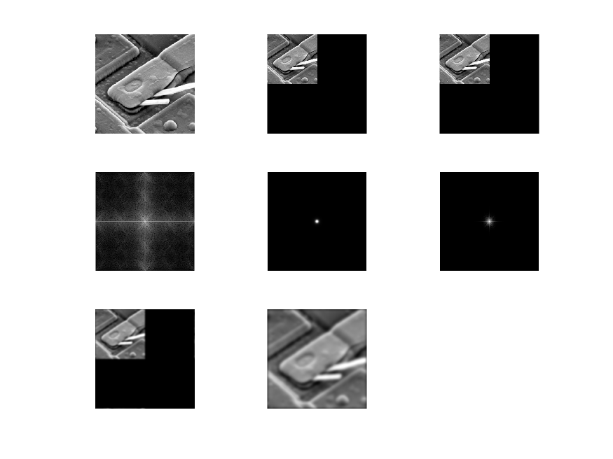
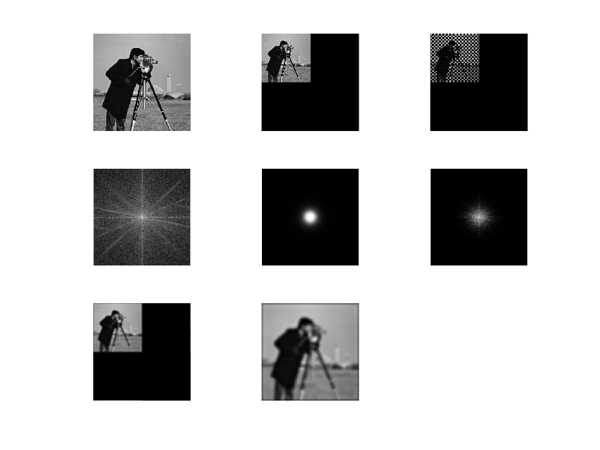
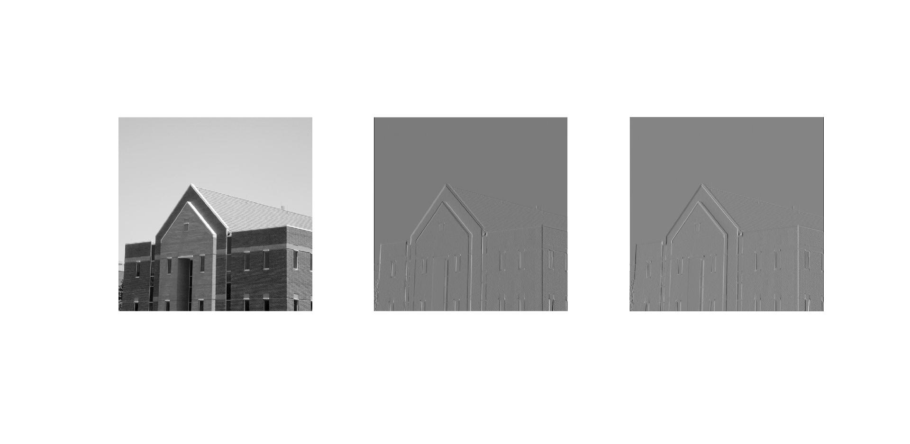
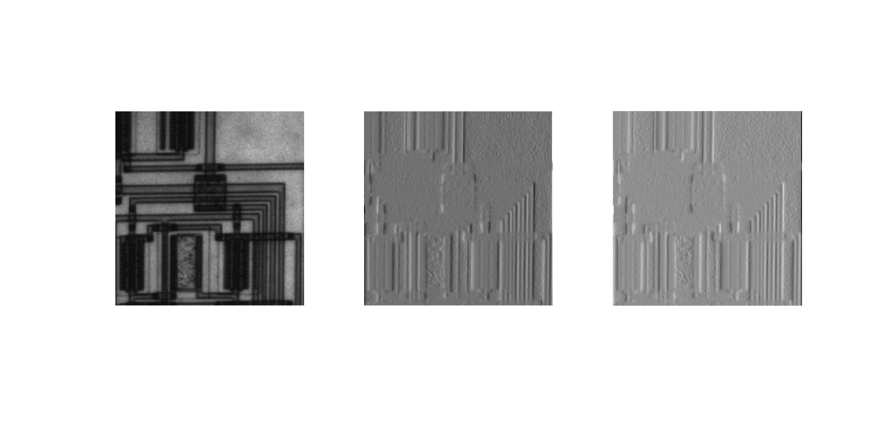
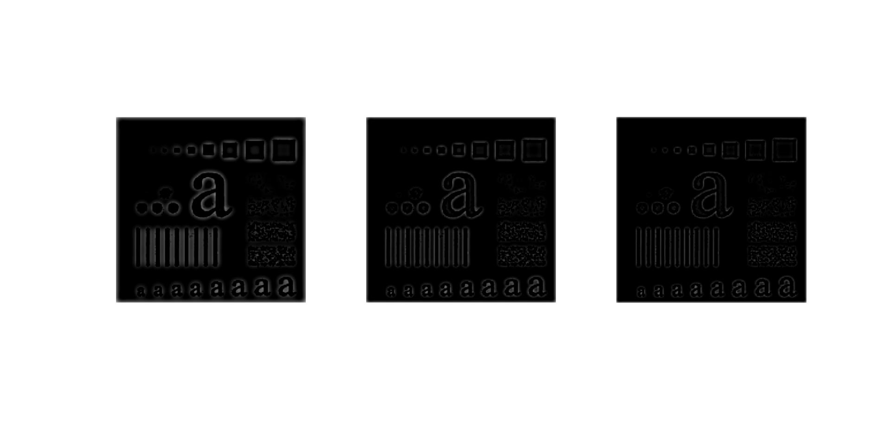
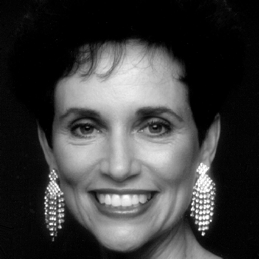

# 作业二

## 实验目标

运用课堂所学频率域与傅里叶变换相关知识，掌握在频率域对图像进行处理的基本方法。


## assignment1

频率域滤波步骤如下：

1. 给定大小为$M \times N$的图像$f(x,y)$，选定填充参数$P=2M$和$Q=2N$。
2. 对$f(x,y)$填充0，形成大小为$P \times Q$的图像$f_p(x,y)$。
3. 用$(-1)^{x+y}$乘以$f_p(x,y)$移到其变换的中心。
4. 计算$f_p(x,y)$的DFT，得到$F(u,v)$。
5. 生成大小为$P \times Q$，中心在$(\frac{P}{2},\frac{Q}{2})$处的实对称滤波$H(x,y)$。
6. 计算阵列乘积$G(x,y)=H(x,y)F(x,y)$。
7. 得到处理之后的图像$g_p(x,y)=real[\Im^{-1}[G(x,y)]] (-1)^{x+y}$。
8. 截取左上角$M \times N$区域，得到$g(x,y)$。

实验结果如下：



对照实验结果，分析每一步代码和结果：

第一步只需读取图像，但是为了后续处理，使用`im2double()`转换图像。

```matlab
im = imread('../asset/image/436.tif');
f = im2double(im);
```

第二步填充，为了避免显式循环，使用两次切片。结果图像占据左上角四分之一。

```matlab
[m, n] = size(im);
f(m+1:2*m, :) = 0;
f(:, n+1:2*n) = 0;
```

第三步乘以$(-1)^{x+y}$，同样为了避免循环，先生成一个`mask`，再相乘。

```matlab
mask = ones(2*m, 2*n);
mask(1:2:end, 2:2:end) = -1;
mask(2:2:end, 1:2:end) = -1;
f = f .* mask;
```

第四步执行DFT，注意显示的时候，要取模取对数。看到频谱水平和垂直响应较强，但是原始图像存在很多斜边，所以仔细看也能发现很多斜向响应。

```matlab
F = fft2(f);
imshow(log(1+abs(F)), []);
```

第五步生成一个$D_0=30$的二阶巴特沃斯滤波器，这里使用向量广播技巧。生成的滤波器自然只有中心圆点响应。

```matlab
y = -m+1:m;
x = -n+1:n;
H = 1./(1+((x.^2+y'.^2)/900).^2);
```

第六步将频率域阵列相乘，仅剩低频信号。

```matlab
G = H .* F;
```

第七步执行傅里叶反变换，取实部，并乘`mask`。可以看到滤波之后的图像位于左上角四分之一。

```matlab
g = ifft2(G);
g = real(g);
g = g .* mask;
```

第八步截取左上角，使用索引即可，得到最终输出。

```matlab
g = g(1:m, 1:n);
```

对Matlab自带的摄像师也进行图片频率域滤波，进一步说明程序正确性：



实验中遇到的问题是先将图像乘以$(-1)^{x+y}$移到变换中心再做傅里叶变换，这是教材的办法，但在Matlab中更加常见的做法是先做傅立叶变换再调用`fftshift()`函数，这两者在效果上是等价的。另外避免显式循环也有很多技巧，实验中主要通过各种切片索引完成。


## assignment2

这项任务的主要挑战在于给定空间域滤波器，如何生成对应频率域滤波。教材给出的步骤如下：

1. 用0填充$h(x,y)$，这里Sobel模板是奇对称，$h_p(x,y)$也应保持奇对称。
2. 乘以$(-1)^{x+y}$，中心化滤波器。
3. 计算DFT，将实部置0。
4. 乘以$(-1)^{u+v}$，得到$H(u,v)$。

其中，保持奇对称最为关键，实现代码如下：

```matlab
h = zeros(m+2, n+2);
a = fix(m/2)+1;
b = fix(n/2)+1;
h(a:a+2, b:b+2) = [-1,0,1;-2,0,2;-1,0,1];
h = h .* mask;
H = fft2(h);
H = imag(H) .* i;
H = H .* mask;
```

空间域滤波的实现不得不使用循环，每次将局部图像与滤波器相乘求和即可。

```matlab
f = zeros(m+2, n+2);
f(2:m+1, 2:n+1) = im2double(im);
h = [-1,0,1;-2,0,2;-1,0,1];
g = zeros(m, n);
for i = 1:m
    for j = 1:n
        g(i, j) = sum(f(i:i+2, j:j+2) .* h, 'all');
    end
end
```

下面是实验结果，左边是原图，中间是频率域滤波，右边是空间域滤波。



我还尝试了一个边缘更加明显的图像，可见Sobel模板对于垂直或水平边缘检测的确不错。



## assignment3

在第一个任务中已经实现了巴特沃斯低通滤波器，稍加修改就能得到巴特沃斯高通滤波器。

```matlab
D = [30, 45, 60];
for i = 1:3
    y = -m+1:m;
    x = -n+1:n;
    H = 1./(1+((D(i).^2)./(x.^2+y'.^2)).^2);
end
```



可以看到$D_0$较小产生振铃现象，而且边界较粗，小物体丢失，而随着$D_0$增大，振铃缓解，细节更加清楚。


## assignment4

我尝试高斯滤波、线性滤波、拉普拉斯、梯度锐化等混合结果，发现结果均不尽如人意。几个问题在于，高斯滤波使得图像模糊，如果模糊程度不够那么美颜效果不足，如果过于模糊那么需要考虑补充细节，但是使用拉普拉斯和梯度锐化，相当于衰减高斯效果，得到的结果有一种干燥之感。

上网查询磨皮相关图像处理技术，发现双向滤波可以较好解决这一问题，它的原理不同于高斯滤波仅考虑像素空间距离，它同时考虑像素灰度距离，即对于当前点$(i,j)$，其邻近点$(x,y)$的权重由空间距离和灰度距离决定，其中空间距离$\exp\frac{(x-i)^2+(y-j)^2}{2\sigma_d^2}$，灰度距离$\exp\frac{(f(x,y)-f(i,j))^2}{2\sigma_r^2}$，权重$w(x,y,i,j)$即为它们乘积。

下面是处理前后的图像对比，可以看到皮肤质量明显改善，同时皱纹也有一些缓解，效果不错。



