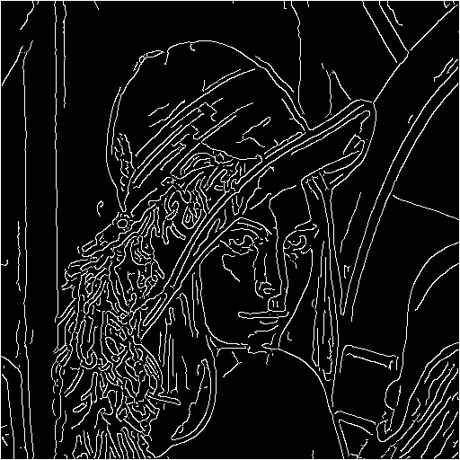
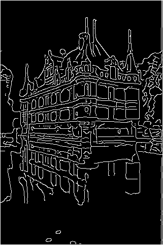
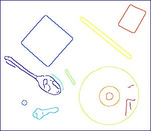
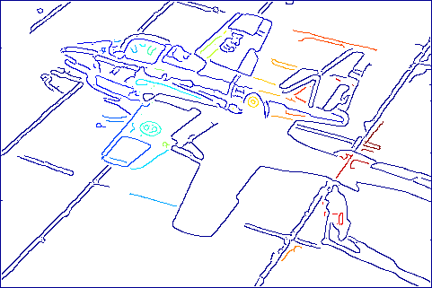

# 作业三

## 实验目标

实现边缘检测算法和边缘追踪算法，具体地，笔者在实验中实现了Canny边缘检测和基于24连通的边缘追踪。


## 边缘检测

Canny边缘检测包含五个步骤：

1. 高斯平滑图像
2. 计算梯度幅值和角度
4. 非最大抑制
5. 滞后阈值检测
6. 连通分析

实验结果如下：





不难看出笔者实现的Canny算法效果较好，可以逼近甚至超越MATLAB自带函数。下面对照算法步骤，展示分析每一步代码。

第一步高斯平滑，调用`imgaussfilt()`函数即可，需要注意的是$\sigma$应该设置大一些，如果仅用默认的0.5，最终结果噪声较多。

```matlab
im = imgaussfilt(im, 2);
```

第二步计算梯度，使用Sobel算子近似，梯度大小$M(x,y)=\sqrt{g_x^2+g_y^2}$，梯度方向$\alpha(x,y)=\arctan\frac{g_y}{g_x}$。

```matlab
gx = imfilter(im, [1 2 1; 0 0 0; -1 -2 -1]);
gy = imfilter(im, [1 0 -1; 2 0 -2; 1 0 -1]);
m = sqrt(gx.^2 + gy.^2);    % 梯度大小
alpha = atan(gy./gx);   % 梯度方向
```

第三步非最大抑制，考虑水平、垂直、+45°、-45°四个方向，确定与梯度方向最接近的方向，并将梯度大小与该方向两个近邻比较，决定是否抑制。

```matlab
[~, d] = min(abs(alpha(:) - (-pi/2:pi/4:pi/2)), [], 2);	% 最接近的方向
d(d == 5) = 1;  
d = reshape(d, size(im));
b = [0,-1; 1,-1; 1,0; 1,1];	% 四种方向坐标偏移
g = m;
for i = 2:h-1
    for j = 2:w-1
        k = d(i,j);
        if m(i+b(k,1),j+b(k,2)) > m(i,j) || m(i-b(k,1),j-b(k,2)) > m(i,j)
            g(i,j) = 0;	% 非最大抑制
        end
    end
end
```

第四步滞后阈值，确定高阈值$T_H$和低阈值$T_L$，梯度大小大于高阈值的点组成强边缘点集$g_h$，梯度大小在两阈值之间的组成弱边缘点集$g_l$。

```matlab
th = 0.1;   % 高阈值
tl = 0.4 * th;  % 低阈值
gh = g >= th;
gl = g < th & g >= tl;
```

第五步连通分析，保留$g_l$中与$g_h$的点8连通的点集，并与$g_h$合并。代码实现中对$g_h$中每个点的连通分量深度有限遍历，将其中属于$g_l$中的点保留，最终结果为$g$。

```matlab
row = zeros(h*w, 1);  % 行索引栈
col = zeros(h*w, 1);  % 列索引栈
top = sum(gh(:));   % 栈顶
[row(1:top), col(1:top)] = find(gh);
b = [-1 -1; -1 0; -1 1; 0 -1; 0 1; 1 -1; 1 0; 1 1];    % 八个邻居偏移
g = gh;
while top > 0
    i = row(top);
    j = col(top);
    top = top - 1;	% 出栈
    for k = 1:8
        x = i + b(k, 1);
        y = j + b(k, 2);
        if x>=1 && x<=h && y>=1 && y<=w && gl(x, y)==1
            top = top + 1;	% 入栈
            row(top) = x;
            col(top) = y;
            g(x, y) = 1;	% 加入该点
            gl(x, y) = 0;	% 标记置零，防止二次遍历
        end
    end
end
```


## 边缘追踪

24连通是指每个点与以其为中心的5*5方块中24个其他点连通，基于24连通的边缘追踪算法，是将每个24连通分量作为一类，即物体边缘。实验结果如下：





第一幅的结果非常不错，因为物体之间间隔较大，不容易造成不同物体边缘合并，但第二幅明显可以观察到该现象。

代码实现仍然使用栈来完成深度优先搜索构建连通分量，对每个未被访问的边缘点执行深度优先搜索，将其连通分量的点都标记成同一类，最后调用`label2rgb()`完成可视化。

```matlab
function f = edgetrace(g)
% 输入二值图像，输出边缘分量
[h, w] = size(g);
[by, bx] = meshgrid(-2:2);
b = [-1 -1; -1 0; -1 1; 0 -1; 0 1; 1 -1; 1 0; 1 1];    % 八个邻居偏移
f = uint16(~g);
c = 1;  % 连通分量数
for j = 1:w
    for i = 1:h
        if f(i, j) == 0
            c = c + 1;
            f(i, j) = c;
            row = i;    % 行索引栈
            col = j;    % 列索引栈
            while ~isempty(row)
                s = row(end);
                t = col(end);
                row(end) = [];
                col(end) = [];
                for k = 1:25
                    x = s + bx(k);
                    y = t + by(k);
                    if x>=1 && x<=h && y>=1 && y<=w && f(x, y)==0
                        row(end + 1) = x;
                        col(end + 1) = y;
                        f(x, y) = c;
                    end
                end
            end
        end
    end
end
f = label2rgb(f - 1);
```